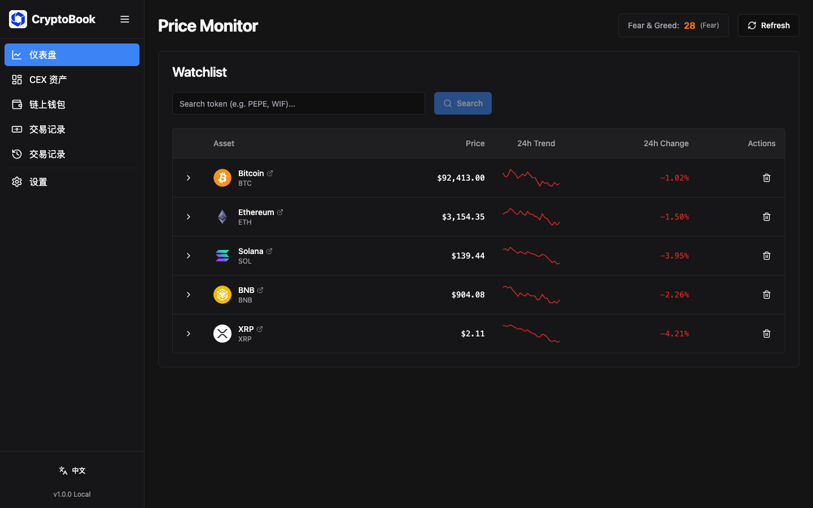
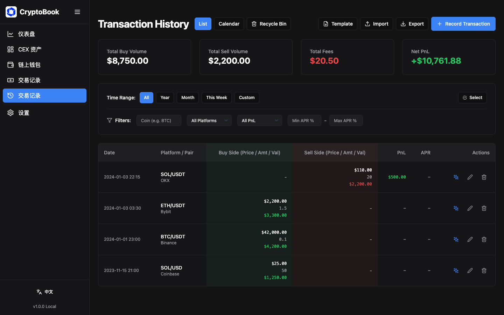
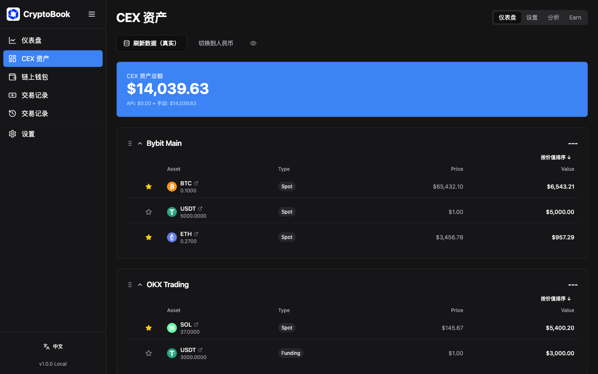

# 🪙 Crypto Bookkeeper - 加密货币资产记账本

> 个人加密货币资产管理工具 | 支持 CEX API 集成、AI 投资分析、交易记录管理

[](https://github.com/Penny777btc/crypto-bookkeeper)
[](LICENSE)
[](https://reactjs.org/)
[](https://www.typescriptlang.org/)

---

## 📖 项目简介

**Crypto Bookkeeper** 是一款功能强大的个人加密货币资产管理工具，帮助您轻松追踪和管理跨平台的加密货币投资组合。

### ✨ 核心特性

#### 💼 资产管理
- **CEX 资产监控** - 通过 API 集成 Bybit、OKX 等中心化交易所
- **手动资产管理** - 记录 API 无法抓取的资产（质押、理财等）
- **链上钱包追踪** - 管理和监控多链钱包地址
- **实时价格更新** - 集成 CoinGecko API 获取实时市场数据

#### 📊 交易记录
- **完整交易历史** - 支持买入、卖出交易记录
- **自动 PnL 计算** - 实时计算已实现盈亏和年化收益率
- **多价格模式** - 支持分批买入的多价格记录
- **费用追踪** - 固定费用和百分比费用两种模式
- **批量导入/导出** - Excel 格式批量管理交易

#### 🤖 AI 智能分析
- **投资组合分析** - AI 驱动的资产配置建议
- **代币深度分析** - 基于价格、技术指标的 AI 洞察
- **自定义 AI 提供商** - 支持 OpenAI、DeepSeek、Claude 等
- **本地分析模式** - 无需 API 也可获得基础分析

#### 📈 数据可视化
- **资产分布图** - 饼图展示投资组合配置
- **PnL 日历视图** - 按月查看盈亏情况
- **价格监控** - 实时价格监控和预警
- **理财产品** - 查看和管理 CEX 理财产品

#### 🔒 隐私与安全
- **本地数据存储** - 所有敏感数据存储在浏览器本地
- **API 密钥加密** - 敏感信息不会上传到服务器
- **导出备份** - 一键导出完整数据备份
- **完整中文界面** - 全面中文本地化支持

---

## 💝 支持开发

如果这个项目帮助到了您，让您的加密货币管理变得更轻松，或者节省了您宝贵的时间，请考虑给我一点支持 ☕

您的每一份捐赠都是对开源精神的认可，也是我持续改进和维护这个项目的最大动力。无论金额大小，都会让我感到温暖和鼓舞！

**EVM 钱包地址** (ETH, USDT, USDC, etc.):
```
0xcC5d9a7697CD081Fc9cB7760FA17Bd4e416eCF34
```

🙏 感谢您的慷慨与支持！每一份贡献都让这个项目变得更好！

---

## 📸 应用截图

### 主界面


*CEX 资产总览 - 支持多交易所聚合展示*

### 交易记录管理

*详细的交易历史和自动 PnL 计算*

### AI 投资分析

*智能投资组合分析和代币洞察*

### 手动资产管理

*灵活记录无法通过 API 获取的资产*

---

## 🚀 快速开始

### 环境要求

- **Node.js** >= 18.0
- **npm** >= 9.0
- 现代浏览器（Chrome、Firefox、Safari、Edge）

### 一键安装（推荐）

```bash
# 克隆仓库
git clone https://github.com/Penny777btc/crypto-bookkeeper.git
cd crypto-bookkeeper

# 运行安装脚本
./install.sh
```

安装脚本会自动：
- ✅ 检查 Node.js 环境
- ✅ 安装前端和后端依赖
- ✅ 创建配置文件

### 手动安装

#### 1. 克隆仓库

```bash
git clone https://github.com/Penny777btc/crypto-bookkeeper.git
cd crypto-bookkeeper
```

#### 2. 安装依赖

```bash
# 安装前端依赖
npm install

# 安装后端依赖（可选，用于 CEX API 集成）
cd server
npm install
cd ..
```

#### 3. 启动应用

```bash
# 启动前端开发服务器
npm run dev

# 在另一个终端启动后端服务（可选）
cd server
node index.js
```

#### 4. 访问应用

打开浏览器访问：**http://localhost:5173**

---

## 📚 使用指南

### 🔰 首次使用

1. **访问应用**：打开 http://localhost:5173
2. **可选配置 CEX API**：
   - 进入 `Settings` → `CEX API`
   - 添加 Bybit 或 OKX 的只读 API 密钥
3. **开始记录交易**：
   - 进入 `Transactions` 页面
   - 点击 `Add Transaction`

### 1️⃣ CEX 资产配置

1. 进入 **CEX Assets** 页面
2. 点击 **Settings** 标签
3. 添加交易所 API 配置：
   - 选择交易所（Bybit/OKX）
   - 输入 API Key 和 API Secret
   - （可选）配置费率
4. 点击 **Load Data (Real)** 获取实时资产

### 2️⃣ 手动资产管理

1. 在 CEX Assets 页面滚动到底部
2. 找到**手动资产**模块
3. 点击 **添加资产** 按钮
4. 填写交易所、币种、数量、备注

### 3️⃣ 记录交易

1. 进入 **Transactions** 页面
2. 点击 **Add Transaction** 按钮
3. 填写交易详情：
   - 类型（Buy/Sell）
   - 交易对、数量、价格
   - 费用信息
4. 系统自动计算 PnL 和 APR

### 4️⃣ AI 投资分析

#### 投资组合分析
1. 进入 **CEX Assets** → **Analysis** 标签
2. 点击 **Ask AI** 按钮
3. 配置 API 密钥（首次使用）
4. 查看 AI 生成的投资建议

#### 代币分析
1. 在 **Transactions** 页面
2. 点击任意代币旁的 ✨ 图标
3. AI 会分析该代币的投资价值

### 5️⃣ 数据备份

#### 导出数据
1. 进入 **Settings** 页面
2. 滚动到 **Backup & Export** 区域
3. 点击 **Export All Data**
4. 保存 JSON 文件到安全位置

#### 导入数据
1. 在 **Settings** 页面点击 **Import Data**
2. 选择之前导出的 JSON 文件
3. 确认导入

---

## 🛠️ 技术栈

### 前端
- **React 18** - UI 框架
- **TypeScript** - 类型安全
- **Vite** - 构建工具
- **Tailwind CSS** - 样式框架
- **Zustand** - 状态管理
- **Recharts** - 数据可视化
- **i18next** - 国际化

### 后端（可选）
- **Node.js** - 运行时
- **Express** - Web 框架  
- **ccxt** - 加密货币交易所 API 库

### 集成服务
- **CoinGecko API** - 价格数据
- **OpenAI API** - AI 分析（可配置其他提供商）
- **Bybit/OKX API** - 交易所数据

---

## 📁 项目结构

```
crypto-bookkeeper/
├── src/
│   ├── components/          # React 组件
│   │   ├── ai/             # AI 分析组件
│   │   ├── cex/            # CEX 资产组件
│   │   ├── transactions/   # 交易记录组件
│   │   ├── ui/             # 通用 UI 组件
│   │   └── settings/       # 设置组件
│   ├── pages/              # 页面组件
│   ├── store/              # Zustand 状态管理
│   ├── types/              # TypeScript 类型定义
│   ├── utils/              # 工具函数
│   ├── i18n/               # 国际化配置
│   └── config/             # 配置文件
├── server/                 # 后端服务（可选）
│   ├── index.js           # 主服务器
│   └── defi/              # DeFi 协议集成
├── public/                 # 静态资源
├── screenshots/            # 应用截图
├── .env.example           # 环境配置示例
├── install.sh             # 一键安装脚本
└── package.json           # 项目配置
```

---

## ⚙️ 配置说明

### API 配置

#### CEX API
在应用内的 **Settings** 页面配置，支持：
- Bybit API
- OKX API
- 自定义费率

**安全建议**：
- ✅ 使用**只读权限**的 API 密钥
- ✅ 在交易所设置 IP 白名单（可选）
- ✅ 定期轮换 API 密钥

#### AI API
支持以下提供商（在应用内配置）：
- **OpenAI** (gpt-3.5-turbo, gpt-4)
- **DeepSeek** (自定义 Base URL)
- **Anthropic Claude** (通过代理)
- 其他 OpenAI 兼容 API

查看 `.env.example` 了解配置详情。

---

## 🔐 安全与隐私

### 数据存储
- ✅ **所有数据存储在浏览器 localStorage**
- ✅ **不会上传到任何远程服务器**
- ✅ **API 密钥仅保存在本地**

### 最佳实践
- 🔒 定期导出备份数据
- 🔒 妥善保管导出的 JSON 文件
- 🔒 使用只读权限的 API 密钥
- 🔒 定期轮换 API 密钥
- 🔒 不要将备份文件提交到 Git

---

## ❓ 常见问题

### Q: 需要什么环境？
**A**: Node.js 18+ 和现代浏览器（Chrome/Firefox/Safari/Edge）

### Q: 数据安全吗？
**A**: 所有数据存储在浏览器本地（localStorage），不会上传到任何服务器。建议定期导出备份。

### Q: 支持哪些交易所？
**A**: 目前支持 Bybit 和 OKX API 集成。也可以手动添加任何交易所的资产。

### Q: 可以导出数据吗？
**A**: 可以！在 Settings 页面点击 "Export All Data" 即可导出完整的 JSON 格式备份。

### Q: AI 分析需要付费吗？
**A**: AI 功能需要 OpenAI 或其他提供商的 API 密钥（需自行购买）。也可以使用免费的"本地分析"模式。

### Q: 后端服务器是必需的吗？
**A**: 不是。后端服务器仅用于 CEX API 集成。如果只用手动记录功能，只运行前端即可。

### Q: 如何更新到最新版本？
```bash
git pull origin main
npm install
cd server && npm install
```

---

## 📝 开发指南

### 本地开发

```bash
# 安装依赖
npm install

# 启动开发服务器（带热重载）
npm run dev

# 构建生产版本
npm run build

# 预览生产构建
npm run preview
```

### 代码规范

```bash
# 类型检查
npm run type-check

# 代码格式化
npm run format

# Lint 检查
npm run lint
```

---

## 🗺️ 路线图

### ✅ 已完成
- [x] CEX 资产集成（Bybit、OKX）
- [x] 交易记录管理
- [x] AI 投资分析
- [x] 手动资产管理
- [x] 完整中文本地化
- [x] 数据导入/导出

### 🚧 进行中
- [ ] 更多 CEX 支持（Binance、Gate.io）
- [ ] 链上钱包完整集成
- [ ] DeFi 协议支持

### 💡 计划中
- [ ] 移动端应用
- [ ] 税务报告生成
- [ ] 更多图表和可视化
- [ ] 自动化交易策略回测
- [ ] 多用户支持

---

## 🤝 贡献指南

欢迎贡献！如有建议或发现 Bug，请：

1. Fork 本仓库
2. 创建特性分支 (`git checkout -b feature/AmazingFeature`)
3. 提交更改 (`git commit -m 'Add some AmazingFeature'`)
4. 推送到分支 (`git push origin feature/AmazingFeature`)
5. 开启 Pull Request

---

## 📄 许可证

本项目采用 MIT 许可证 - 查看 [LICENSE](LICENSE) 文件了解详情

---

## 🙏 致谢

- [CoinGecko](https://www.coingecko.com/) - 提供免费的加密货币价格 API
- [ccxt](https://github.com/ccxt/ccxt) - 强大的交易所 API 库
- [Recharts](https://recharts.org/) - 优秀的 React 图表库
- [Lucide Icons](https://lucide.dev/) - 精美的图标库

---

## 📞 联系方式

- **GitHub**: [Penny777](https://github.com/Penny777btc)
- **Twitter**: [Penny777](https://x.com/Penny777_eth)

---

## ⚠️ 免责声明

本工具仅用于个人资产管理和学习目的。加密货币投资存在高风险，请谨慎投资。本工具不构成任何投资建议。

---

<div align="center">

**⭐ 如果这个项目对您有帮助，请给个 Star！**

Made with ❤️ by Penny777

</div>
